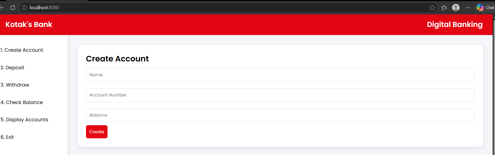
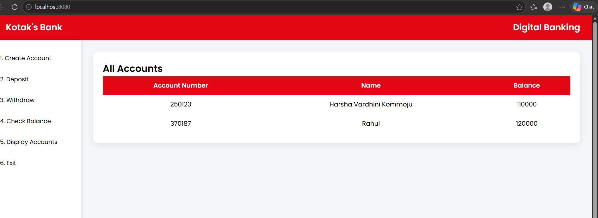

# Bank Management System

## 📌 Description
This is a beginner-level banking web application built using Java and Spring Boot.  
The application allows users to create bank accounts and view account details through a simple user interface.

---

## 🚀 Features
- Create new bank account  
- View all existing accounts  
- Basic banking operations  
- Simple and user-friendly UI  

---

## 🛠️ Technologies Used
- Java  
- Spring Boot  
- MySQL  
- HTML & CSS  

---

## 📸 Screenshots

### 🧾 Create Account Page

### 📊 Display All Accounts

---

## 💡 Functionality
- Users can create new bank accounts by entering required details  
- The system stores account data in a database  
- Users can view all created accounts in a structured format  

---

## ▶️ How to Run
1. Clone the repository  
2. Open the project in IntelliJ / Eclipse / VScode
3. Configure MySQL database connection  
4. Run the Spring Boot application  
5. Open browser and go to:  
   http://localhost:8080  

---

## 📂 Project Structure
- `controller/` → Handles user requests  
- `service/` → Business logic  
- `repository/` → Database operations  
- `model/` → Data models  
- `templates/` → HTML pages  

---

## 👨‍💻 Author
Harsha
